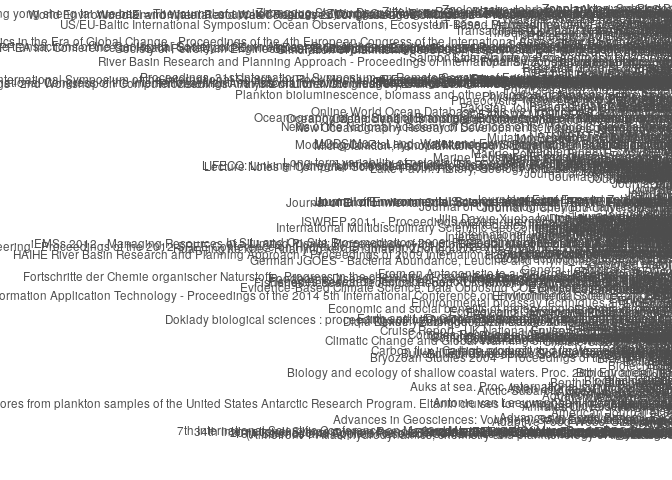
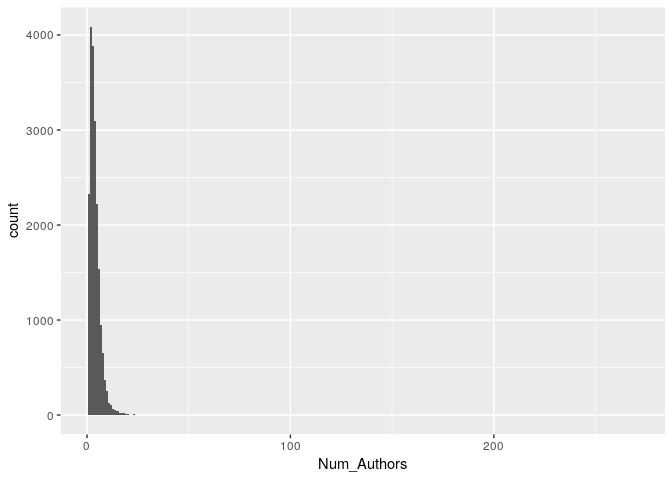
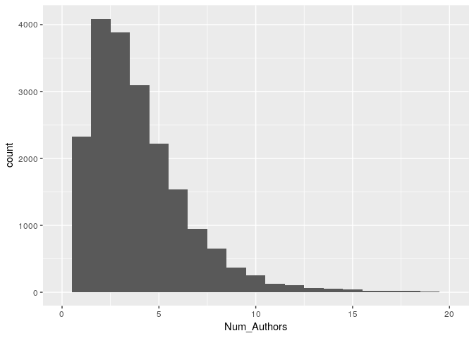
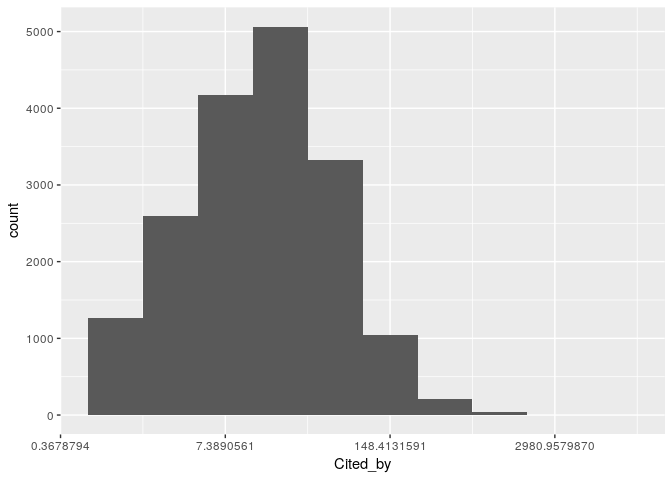
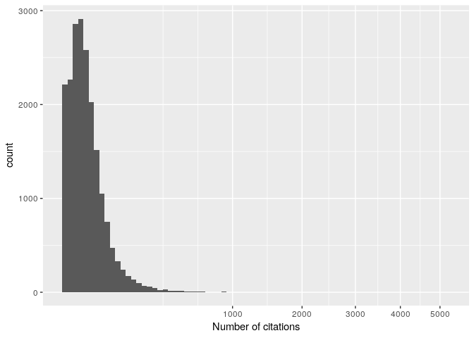
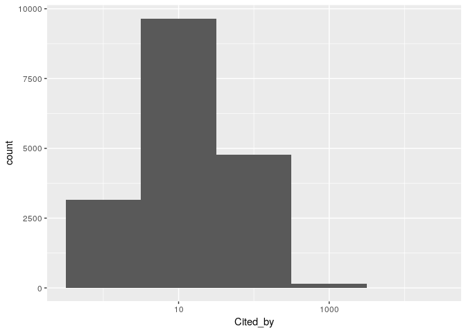

Data wrangling & visualization in R: a tour of the tidyverse
================
Stefano Allesina
Oct 4, 2018

Before we start
---------------

Let's load all of the packages we'll need. If you need to install any of these, type `install.packages("my_package_name")` in the console.

``` r
library(tidyverse) # data wrangling and visualization
library(igraph) # network analysis
library(ggnetwork) # networks in ggplot
```

Data wrangling
--------------

As biologists living in the XXI century, we are often faced with tons of data, possibly replicated over several organisms, treatments, or locations. We would like to streamline and automate our analysis as much as possible, writing scripts that are easy to read, fast to run, and easy to debug. Base `R` can get the job done, but often the code contains complicated operations (think of the cases in which you used `lapply` only because of its speed), and a lot of `$` signs and brackets.

We're going to learn about the `tidyverse` bundle of packages: this is a collection of `R` packages, which can be used to manipulate large data frames in a simple and straightforward way. These tools are also much faster than the corresponding base `R` commands, are very compact, and can be concatenated into "pipelines". Moreover, all of the packages in the bundle share the same philosophy, and are seamlessly integrated.

Reading the data
----------------

The package `readr` provides new commands to read data into `R`. It provides the functions - `read_csv()`: comma separated (CSV) files - `read_tsv()`: tab separated files - `read_delim()`: general delimited files - `read_fwf()`: fixed width files - `read_table()`: tabular files where colums are separated by white-space.

These commands are much faster than the base-`R` equivalents. Also, they have better control of time/date columns, do not convert strings into factors, and show a progress bar when the file to read is large.

Let's try it out. For this tutorial, we are going to use a dataset containing about 20,000 scientific articles that mention "plankton" in the title, abstract or keyword, and that have been published after 1990:

``` r
papers <- read_csv("../data/papers_plankton.csv")
```

What is our `paper` object?

``` r
class(papers)
```

    ## [1] "tbl_df"     "tbl"        "data.frame"

This is the main class provided by the `tidyverse`, called a "tibble". Basically, it's an improved version of the `data.frame` of base-`R`. The nice feature of `tbl` objects is that they will print only what fits on the screen, and also give you useful information on the size of the data, as well as the type of data in each column. Other than that, a `tbl` object behaves very much like a `data.frame`. In some rare cases, you want to transform the `tbl` back into a `data.frame`. For this, use the function `as.data.frame(tbl_object)`.

We can take a look at the data using one of several functions:

``` r
head(papers) # first few rows
```

    ## # A tibble: 6 x 9
    ##   Authors Author_Ids Title  Year Source_title Cited_by DOI   Document_Type
    ##   <chr>   <chr>      <chr> <int> <chr>           <int> <chr> <chr>        
    ## 1 Wu, P.… 571893615… The …  2019 Science of …       NA 10.1… Review       
    ## 2 Hernán… 670146567… Carb…  2019 Journal of …       NA 10.1… Article      
    ## 3 Sarmie… 150301568… Cret…  2019 Frontiers i…       NA 10.1… Book Chapter 
    ## 4 Evans,… 571533034… No s…  2018 Nature Comm…       NA 10.1… Letter       
    ## 5 Martin… 140163200… High…  2018 Nature Comm…        3 10.1… Article      
    ## 6 Bernar… 572026700… Mass…  2018 Scientific …       NA 10.1… Article      
    ## # ... with 1 more variable: EID <chr>

``` r
tail(papers) # last few rows
```

    ## # A tibble: 6 x 9
    ##   Authors Author_Ids Title  Year Source_title Cited_by DOI   Document_Type
    ##   <chr>   <chr>      <chr> <int> <chr>           <int> <chr> <chr>        
    ## 1 Prell,… 700450836… Vari…  1990 Paleoceanog…       31 10.1… Article      
    ## 2 HART, … 356101626… Zoop…  1990 Freshwater …       34 10.1… Article      
    ## 3 Erikss… 162148421… Sele…  1990 Canadian Jo…        7 10.1… Article      
    ## 4 Glynn,… 562499201… Cora…  1990 Elsevier Oc…       67 10.1… Article      
    ## 5 Brockm… 660261451… Cycl…  1990 Netherlands…       87 10.1… Article      
    ## 6 Reid, … 720242645… Phyt…  1990 Netherlands…      156 10.1… Article      
    ## # ... with 1 more variable: EID <chr>

``` r
glimpse(papers) # structure of the table
```

    ## Observations: 19,938
    ## Variables: 9
    ## $ Authors       <chr> "Wu, P., Kainz, M.J., Bravo, A.G., Åkerblom, S.,...
    ## $ Author_Ids    <chr> "57189361550; 6603777548; 26654082100; 560580857...
    ## $ Title         <chr> "The importance of bioconcentration into the pel...
    ## $ Year          <int> 2019, 2019, 2019, 2018, 2018, 2018, 2018, 2018, ...
    ## $ Source_title  <chr> "Science of the Total Environment", "Journal of ...
    ## $ Cited_by      <int> NA, NA, NA, NA, 3, NA, NA, NA, 1, 2, 1, NA, 6, 2...
    ## $ DOI           <chr> "10.1016/j.scitotenv.2018.07.328", "10.1016/j.jm...
    ## $ Document_Type <chr> "Review", "Article", "Book Chapter", "Letter", "...
    ## $ EID           <chr> "2-s2.0-85050497779", "2-s2.0-85053440976", "2-s...

``` r
# to see in a spreadsheet View(papers)
```

Selecting rows and columns
--------------------------

There are many ways to subset the data, either by row (subsetting the *observations*), or by column (subsetting the *variables*). For example, suppose we want to count how many of papers were published in `Marine Ecology Progress Series`. The column `Source_title` contains the title of the journal: let's extract only the papers in MEPS:

``` r
filter(papers, Source_title == "Marine Ecology Progress Series")
```

    ## # A tibble: 754 x 9
    ##    Authors      Author_Ids     Title      Year Source_title Cited_by DOI  
    ##    <chr>        <chr>          <chr>     <int> <chr>           <int> <chr>
    ##  1 McGinty, N.… 37461825600; … Traits s…  2018 Marine Ecol…       NA 10.3…
    ##  2 Schulz, I.,… 55452762600; … Remarkab…  2018 Marine Ecol…       NA 10.3…
    ##  3 Huebert, K.… 25230018900; … Modeled …  2018 Marine Ecol…       NA 10.3…
    ##  4 Dong, Y., L… 56668131700; … Size-dep…  2018 Marine Ecol…       NA 10.3…
    ##  5 Paul, A.J.,… 56939822500; … Baltic S…  2018 Marine Ecol…       NA 10.3…
    ##  6 Van Der Sle… 53664696600; … Non-stat…  2018 Marine Ecol…       NA 10.3…
    ##  7 Larsson, M.… 57203252521; … Hitchhik…  2018 Marine Ecol…       NA 10.3…
    ##  8 Brereton, A… 57194189816; … Large-ed…  2018 Marine Ecol…       NA 10.3…
    ##  9 Kacenas, S.… 56809437100; … Density-…  2018 Marine Ecol…       NA 10.3…
    ## 10 Umezawa, Y.… 7103308499; 7… Phytopla…  2018 Marine Ecol…        1 10.3…
    ## # ... with 744 more rows, and 2 more variables: Document_Type <chr>,
    ## #   EID <chr>

You can see that "only" 754 papers mentioning plankton were published in this journal. We have used the command `filter(tbl, conditions)` to select certain observations. We can combine several conditions, by listing them side by side, possibly using logical operators.

> **Exercise:** what does this do?
>
> ``` r
> filter(papers, Cited_by > 100, Source_title == "Science", Year > 2014)
> ```

We can also select particular variables using the function `select(tbl, cols to select)`. For example, select `Source_title` and `Year`:

``` r
select(papers, Source_title, Year)
```

    ## # A tibble: 19,938 x 2
    ##    Source_title                      Year
    ##    <chr>                            <int>
    ##  1 Science of the Total Environment  2019
    ##  2 Journal of Marine Systems         2019
    ##  3 Frontiers in Earth Sciences       2019
    ##  4 Nature Communications             2018
    ##  5 Nature Communications             2018
    ##  6 Scientific Reports                2018
    ##  7 Ecological Indicators             2018
    ##  8 Environmental Pollution           2018
    ##  9 Scientific Reports                2018
    ## 10 Scientific Reports                2018
    ## # ... with 19,928 more rows

How many journals are represented in the data set? We can use the function `distinct(tbl)` to retain only the rows that differ from each other:

``` r
distinct(select(papers, Source_title))
```

Showing that there are 2082 journals, once we removed the duplicates. Other ways to subset observations:

-   `sample_n(tbl, howmany, replace = TRUE)` sample `howmany` rows at random with replacement
-   `sample_frac(tbl, proportion, replace = FALSE)` sample a certain proportion (e.g. `0.2` for 20%) of rows at random without replacement
-   `slice(tbl, 50:100)` extract the rows between `50` and `100`
-   `top_n(tbl, 10, Cited_by)` extract the first `10` rows, once ordered by `Cited_by`

More ways to select columns:

-   `select(papers, contains("Author"))` select all columns containing the word `Author`
-   `select(papers, -Author_Ids, -Title)` exclude the columns `Author_Ids` and `Title`
-   `select(papers, matches("[Tt]itle"))` select all columns whose names match a regular expression

Creating pipelines using `%>%`
------------------------------

We've been calling nested functions, such as `distinct(select(papers, ...))`. If you have to add another layer or two, the code would become unreadable. `dplyr` allows you to "un-nest" these functions and create a "pipeline", in which you concatenate commands separated by the special operator `%>%` (in `RStudio`, press `Ctrl + Shift + M`). For example:

``` r
papers %>% # take a data table
  select(Source_title) %>% # select a column
  distinct() # remove duplicates
```

does exactly the same as the command above, but is much more readable. By concatenating many commands, you can create incredibly complex pipelines while retaining readability.

Renaming columns
----------------

To rename one or more columns, use `rename()`:

``` r
papers %>% rename(au = Authors)
```

    ## # A tibble: 19,938 x 9
    ##    au     Author_Ids Title  Year Source_title Cited_by DOI   Document_Type
    ##    <chr>  <chr>      <chr> <int> <chr>           <int> <chr> <chr>        
    ##  1 Wu, P… 571893615… The …  2019 Science of …       NA 10.1… Review       
    ##  2 Herná… 670146567… Carb…  2019 Journal of …       NA 10.1… Article      
    ##  3 Sarmi… 150301568… Cret…  2019 Frontiers i…       NA 10.1… Book Chapter 
    ##  4 Evans… 571533034… No s…  2018 Nature Comm…       NA 10.1… Letter       
    ##  5 Marti… 140163200… High…  2018 Nature Comm…        3 10.1… Article      
    ##  6 Berna… 572026700… Mass…  2018 Scientific …       NA 10.1… Article      
    ##  7 Béjao… 247340666… Mach…  2018 Ecological …       NA 10.1… Article      
    ##  8 Pazos… 571945595… Micr…  2018 Environment…       NA 10.1… Article      
    ##  9 Ayala… 570234340… Gela…  2018 Scientific …        1 10.1… Article      
    ## 10 Jyoth… 780160990… Mud …  2018 Scientific …        2 10.1… Article      
    ## # ... with 19,928 more rows, and 1 more variable: EID <chr>

Adding new variables using mutate
---------------------------------

If you want to add one or more new columns, or you want to modify an existing column, use the function `mutate`. For example, the data reports `NA` for all papers that have zero citations. Let's change that to zero:

``` r
papers <- papers %>% mutate(Cited_by = ifelse(is.na(Cited_by), 0, Cited_by))
```

Similarly, if we wanted to compute the number of citations by year, we could use:

``` r
papers %>% 
  mutate(Cit_yr = Cited_by / (2019 - Year)) %>% 
  select(Cited_by, Year, Cit_yr)
```

    ## # A tibble: 19,938 x 3
    ##    Cited_by  Year Cit_yr
    ##       <dbl> <int>  <dbl>
    ##  1        0  2019    NaN
    ##  2        0  2019    NaN
    ##  3        0  2019    NaN
    ##  4        0  2018      0
    ##  5        3  2018      3
    ##  6        0  2018      0
    ##  7        0  2018      0
    ##  8        0  2018      0
    ##  9        1  2018      1
    ## 10        2  2018      2
    ## # ... with 19,928 more rows

Use the function `transmute()` to create a new column and drop the original columns.

Ordering the data
-----------------

To order the data according to one or more variables, use `arrange()`:

``` r
papers %>% select(Source_title, Year, Cited_by) %>% arrange(Cited_by)
```

    ## # A tibble: 19,938 x 3
    ##    Source_title                            Year Cited_by
    ##    <chr>                                  <int>    <dbl>
    ##  1 Science of the Total Environment        2019        0
    ##  2 Journal of Marine Systems               2019        0
    ##  3 Frontiers in Earth Sciences             2019        0
    ##  4 Nature Communications                   2018        0
    ##  5 Scientific Reports                      2018        0
    ##  6 Ecological Indicators                   2018        0
    ##  7 Environmental Pollution                 2018        0
    ##  8 Journal of Environmental Radioactivity  2018        0
    ##  9 Scientific Reports                      2018        0
    ## 10 Nature Communications                   2018        0
    ## # ... with 19,928 more rows

``` r
papers %>% select(Source_title, Year, Cited_by) %>% arrange(desc(Cited_by), desc(Year))
```

    ## # A tibble: 19,938 x 3
    ##    Source_title                                              Year Cited_by
    ##    <chr>                                                    <int>    <dbl>
    ##  1 Science                                                   2001     5199
    ##  2 Nature                                                    2005     2223
    ##  3 Proceedings of the National Academy of Sciences of the …  1992     1913
    ##  4 Annual Review of Marine Science                           2009     1659
    ##  5 Microbiology and Molecular Biology Reviews                2000     1554
    ##  6 Nature                                                    2001     1357
    ##  7 Limnology and Oceanography                                2000     1279
    ##  8 Nature                                                    1999     1253
    ##  9 Science                                                   1998     1245
    ## 10 Science                                                   2004     1237
    ## # ... with 19,928 more rows

Producing summaries
-------------------

Sometimes we need to calculate statistics on certain columns. For example, calculate the average number of citations. We can do this using `summarise`:

``` r
papers %>% summarise(avg = mean(Cited_by))
```

which returns a `tbl` object with just the average number of citations. You can combine multiple statistics (use `first`, `last`, `min`, `max`, `n` \[count the number of rows\], `n_distinct` \[count the number of distinct rows\], `mean`, `median`, `var`, `sd`, etc.):

``` r
papers %>% summarise(avg = mean(Cited_by), 
                     sd = sd(Cited_by), 
                     median = median(Cited_by))
```

    ## # A tibble: 1 x 3
    ##     avg    sd median
    ##   <dbl> <dbl>  <dbl>
    ## 1  29.8  77.8     12

Summaries by group
------------------

One of the most useful features of `dplyr` is the ability to produce statistics for the data once subsetted by *groups*. For example, we would like to measure the average number of citations for papers in a given journal/year combination. We can then group the data by `Source_title` and `Year`, and calculate the mean `Cited_by` once the data is split into groups:

``` r
papers %>% group_by(Source_title, Year) %>% 
  summarise(mean_cits = mean(Cited_by)) %>% 
  select(Source_title, Year, mean_cits) %>% 
  arrange(desc(Source_title), Year, mean_cits)
```

    ## # A tibble: 7,916 x 3
    ## # Groups:   Source_title [2,082]
    ##    Source_title        Year mean_cits
    ##    <chr>              <int>     <dbl>
    ##  1 Zootecnia Tropical  2013      0   
    ##  2 Zootaxa             2005      9   
    ##  3 Zootaxa             2007      4.8 
    ##  4 Zootaxa             2008     10.3 
    ##  5 Zootaxa             2009     10   
    ##  6 Zootaxa             2010      1   
    ##  7 Zootaxa             2011      7   
    ##  8 Zootaxa             2012      6.2 
    ##  9 Zootaxa             2013      3.67
    ## 10 Zootaxa             2015      3.5 
    ## # ... with 7,906 more rows

Data plotting
=============

The most salient feature of scientific graphs should be clarity. Each figure should make crystal-clear a) what is being plotted; b) what are the axes; c) what do colors, shapes, and sizes represent; d) the message the figure wants to convey. Each figure is accompanied by a (sometimes long) caption, where the details can be explained further, but the main message should be clear from glancing at the figure (often, figures are the first thing editors and referees look at).

Many scientific publications contain very poor graphics: labels are missing, scales are unintelligible, there is no explanation of some graphical elements. Moreover, some color graphs are impossible to understand if printed in black and white, or difficult to discern for color-blind people.

Given the effort that you put in your science, you want to ensure that it is well presented and accessible. The investment to master some plotting software will be rewarded by pleasing graphics that convey a clear message.

In this section, we introduce `ggplot2`, a plotting package for `R` This package was developed by Hadley Wickham who contributed many important packages to `R` (including `dplyr`). Unlike many other plotting systems, `ggplot2` is deeply rooted in a "philosophical" vision. The goal is to conceive a grammar for all graphical representation of data. Leland Wilkinson and collaborators proposed The Grammar of Graphics. It follows the idea of a well-formed sentence that is composed of a subject, a predicate, and an object. The Grammar of Graphics likewise aims at describing a well-formed graph by a grammar that captures a very wide range of statistical and scientific graphics. This might be more clear with an example -- Take a simple two-dimensional scatterplot. How can we describe it? We have:

-   **Data** The data we want to plot.

-   **Mapping** What part of the data is associated with a particular visual feature? For example: Which column is associated with the x-axis? Which with the y-axis? Which column corresponds to the shape or the color of the points? In `ggplot2` lingo, these are called *aesthetic mappings* (`aes`).

-   **Geometry** Do we want to draw points? Lines? In `ggplot2` we speak of *geometries* (`geom`).

-   **Scale** Do we want the sizes and shapes of the points to scale according to some value? Linearly? Logarithmically? Which palette of colors do we want to use?

-   **Coordinate** We need to choose a coordinate system (e.g., Cartesian, polar).

-   **Faceting** Do we want to produce different panels, partitioning the data according to one (or more) of the variables?

This basic grammar can be extended by adding statistical transformations of the data (e.g., regression, smoothing), multiple layers, adjustment of position (e.g., stack bars instead of plotting them side-by-side), annotations, and so on.

Exactly like in the grammar of a natural language, we can easily change the meaning of a "sentence" by adding or removing parts. Also, it is very easy to completely change the type of geometry if we are moving from say a histogram to a boxplot or a violin plot, as these types of plots are meant to describe one-dimensional distributions. Similarly, we can go from points to lines, changing one "word" in our code. Finally, the look and feel of the graphs is controlled by a theming system, separating the content from the presentation.

Basic `ggplot2`
---------------

`ggplot2` ships with a simplified graphing function, called `qplot`. In this introduction we are not going to use it, and we concentrate instead on the function `ggplot`, which gives you complete control over your plotting.

A particularity of `ggplot2` is that it accepts exclusively data organized in tables (a `data.frame` or a `tbl` object). Thus, all of your data needs to be converted into a data frame format for plotting.

For our first plot, we're going to produce a barplot of the number of papers by journal:

``` r
ggplot(data = papers) # the data
```


As you can see, nothing is drawn: we need to specify what we would like to associate to the *x* axis, and what to the *y* axis (i.e., we want to set the *aesthetic mappings*):

``` r
ggplot(data = papers) + # the data
  aes(x = Source_title) # the aesthetic mapping
```


Note that we concatenate pieces of our "sentence" using the `+` sign! We've got the axes, but still no graph... we need to specify a geometry. Let's use bars:

``` r
ggplot(data = papers) + # the data
  aes(x = Source_title) + # the aesthetic mapping
  geom_bar() + # the geometry
  coord_flip() # swap x and y axes 
```



That's too much information! Let's first count the number of papers by journal, and then only plot journals who've had more than 100 papers on plankton!

``` r
# you can feed a dplyr pipeline directly into ggplot2
papers %>% 
  group_by(Source_title) %>% 
  tally() %>% 
  filter(n > 100) %>% 
  ggplot() + 
  aes(x = Source_title, y = n) +
  geom_col() + # geom_bar does the counting for you; if you have the count already, use geom_bar
  coord_flip()
```


As you can see, whenever we wrote a well-formed sentence, composed of **data** + **mapping** + **geometry**, we obtained a graph.

Scatterplots
------------

Using `ggplot2`, one can produce very many types of graphs. The package works very well for 2D graphs (or 3D rendered in two dimensions), while it lack capabilities to draw proper 3D graphs, or networks.

The main feature of `ggplot2` is that you can tinker with your graph fairly easily, and with a common grammar. You don't have to settle on a certain presentation of the data until you're ready, and it is very easy to switch from one type of graph to another.

For example, let's calculate the median number of citations by `Year`---older papers should have more citations, and store the result in an object:

``` r
pl <- papers %>% group_by(Year) %>% summarise(mm = median(Cited_by)) %>% 
      ggplot() + aes(x = Year, y = mm) + geom_point()

pl # or show(pl)
```


We can add a smoother by typing

``` r
pl + geom_smooth() # spline by default
pl + geom_smooth(method = "lm", se = FALSE) # linear model, no standard errors
```

> **Exercise:** repeat the plot of the median, but choose only papers in `Aquaculture` or `Biogeosciences`. Set the aesthetic mapping `colour` to plot the results by journal.

Histograms, density and boxplots
--------------------------------

Now we're going to add a new column to the data, counting the number of authors:

``` r
papers <- papers %>% 
  mutate(Num_Authors = str_count(Author_Ids, ";") + 1)
```

Now let's produce an histogram of the number of authors per paper:

``` r
pl <- papers %>% ggplot() + aes(x = Num_Authors) + geom_histogram(binwidth = 1)
pl
```



Let's zoom in the area between 1 and 20:

``` r
pl + xlim(0,20)
```

    ## Warning: Removed 76 rows containing non-finite values (stat_bin).



Similarly, we can produce boxplots, for example to check whether the number of authors per paper has been raising:

``` r
papers %>% filter(Year %in% c(1990, 2000, 2010, 2017)) %>% ggplot() + aes(x = as.factor(Year), y = Num_Authors) + geom_boxplot() + ylim(c(0,10))
```

It is very easy to change geometry, for example switching to a violin plot:

``` r
papers %>% filter(Year %in% c(1990, 2000, 2010, 2017)) %>% ggplot() + aes(x = as.factor(Year), y = Num_Authors) + geom_violin() + ylim(c(0,10))
```

    ## Warning: Removed 96 rows containing non-finite values (stat_ydensity).


Scales
------

We can use scales to determine how the aesthetic mappings are displayed. For example, we could set the *x* axis to be in logarithmic scale, or we can choose how the colors, shapes and sizes are used. `ggplot2` uses two types of scales: `continuous` scales are used for continuos variables (e.g., real numbers); `discrete` scales for variables that can only take a certain number of values (e.g., colors, shapes, sizes).

For example, let's plot a histogram of `Cited_by`:

``` r
pl <- ggplot(data = papers) + aes(x = Cited_by) + geom_histogram(binwidth = 1)
pl # no transformation
```


``` r
pl + scale_x_continuous(trans = "log") # natural log
```



``` r
pl + scale_x_continuous(trans = "log10") # base 10 log
```


``` r
pl + scale_x_continuous(trans = "sqrt", name = "Number of citations")
```



``` r
pl + scale_x_log10() # shorthand
```


