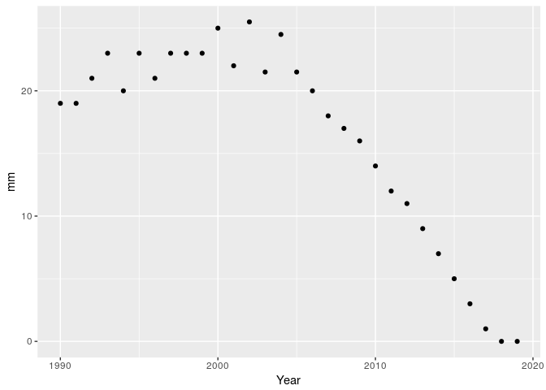
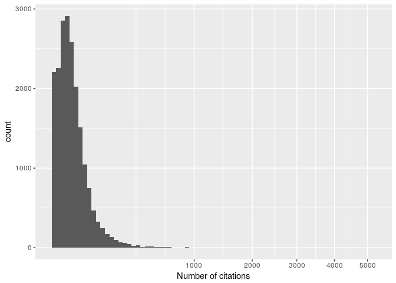
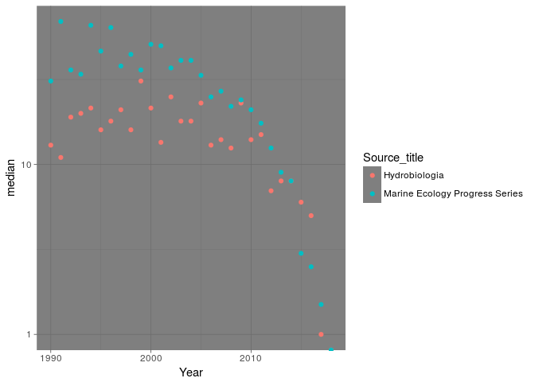

Data wrangling & visualization in R: a tour of the tidyverse
================
Stefano Allesina
Oct 4, 2018

Before we start
===============

Let's load all of the packages we'll need. If you need to install any of these, type `install.packages("my_package_name")` in the console.

``` r
library(tidyverse) # data wrangling and visualization
library(igraph) # network analysis
library(ggnetwork) # networks in ggplot
library(stringr) # needed to count patterns in strings
```

Data wrangling
==============

As biologists living in the XXI century, we are often faced with tons of data, possibly replicated over several organisms, treatments, or locations. We would like to streamline and automate our analysis as much as possible, writing scripts that are easy to read, fast to run, and easy to debug. Base `R` can get the job done, but often the code contains complicated operations (think of the cases in which you used `lapply` only because of its speed), and a lot of `$` signs and brackets.

We're going to learn about the `tidyverse` bundle of packages: a collection of `R` packages designed to manipulate large data frames in a simple and straightforward way. These tools are also much faster than the corresponding base `R` commands, and allow you to write compact code by concatenating commands to build "pipelines". Moreover, all of the packages in the bundle share the same philosophy, and are seamlessly integrated.

Reading the data
----------------

The package `readr` provides new commands to read data into `R`. It contains several functions:

-   `read_csv()`: comma separated (CSV) files
-   `read_tsv()`: tab separated files
-   `read_delim()`: general delimited files
-   `read_fwf()`: fixed width files
-   `read_table()`: tabular files where colums are separated by white-space.

These commands are much faster than the base-`R` equivalents. Also, they have better control of time/date columns, do not convert strings into factors, and show a progress bar when the file to read is large.

Let's try this out. For this tutorial, we are going to use a dataset containing about 20,000 scientific articles that mention "plankton" in the title, abstract or keyword, and that have been published after 1989:

``` r
papers <- read_csv("../data/papers_plankton.csv")
```

What kind of object is `papers`?

``` r
class(papers)
```

    ## [1] "tbl_df"     "tbl"        "data.frame"

This is the main class provided by the `tidyverse`, and is called a "tibble". Basically, a tibble is an improved version of the `data.frame` of base-`R`. The nice feature of `tbl` objects is that they will print only what fits on the screen, and also give you useful information on the size of the data, as well as the type of data in each column. Other than that, a `tbl` object behaves very much like a `data.frame`. In rare cases you might want to transform the `tbl` back into a `data.frame`. For this, use the function `as.data.frame(tbl_object)`.

We can take a look at the data using one of several functions:

``` r
head(papers) # first few rows
```

    ## # A tibble: 6 x 9
    ##                                                                       Authors
    ##                                                                         <chr>
    ## 1    Wu, P., Kainz, M.J., Bravo, A.G., Åkerblom, S., Sonesten, L., Bishop, K.
    ## 2 Hernández-León, S., Putzeys, S., Almeida, C., Bécognée, P., Marrero-Díaz, A
    ## 3                                                       Sarmiento-Rojas, L.F.
    ## 4 Evans, D., Badger, M.P.S., Foster, G.L., Henehan, M.J., Lear, C.H., Zachos,
    ## 5 Martin-Platero, A.M., Cleary, B., Kauffman, K., Preheim, S.P., McGillicuddy
    ## 6 Bernardi Aubry, F., Falcieri, F.M., Chiggiato, J., Boldrin, A., Luna, G.M.,
    ## # ... with 8 more variables: Author_Ids <chr>, Title <chr>, Year <int>,
    ## #   Source_title <chr>, Cited_by <int>, DOI <chr>, Document_Type <chr>,
    ## #   EID <chr>

``` r
tail(papers) # last few rows
```

    ## # A tibble: 6 x 9
    ##                                                                 Authors
    ##                                                                   <chr>
    ## 1                               Prell, W.L., Marvil, R.E., Luther, M.E.
    ## 2                                                            HART, R.C.
    ## 3                                         Eriksson, C., Pedros-Alio, C.
    ## 4                                                           Glynn, P.W.
    ## 5                          Brockmann, U.H., Laane, R.W.P.M., Postma, J.
    ## 6 Reid, P.C., Lancelot, C., Gieskes, W.W.C., Hagmeier, E., Weichart, G.
    ## # ... with 8 more variables: Author_Ids <chr>, Title <chr>, Year <int>,
    ## #   Source_title <chr>, Cited_by <int>, DOI <chr>, Document_Type <chr>,
    ## #   EID <chr>

``` r
glimpse(papers) # structure of the table
```

    ## Observations: 19,938
    ## Variables: 9
    ## $ Authors       <chr> "Wu, P., Kainz, M.J., Bravo, A.G., Åkerblom, S.,...
    ## $ Author_Ids    <chr> "57189361550; 6603777548; 26654082100; 560580857...
    ## $ Title         <chr> "The importance of bioconcentration into the pel...
    ## $ Year          <int> 2019, 2019, 2019, 2018, 2018, 2018, 2018, 2018, ...
    ## $ Source_title  <chr> "Science of the Total Environment", "Journal of ...
    ## $ Cited_by      <int> NA, NA, NA, NA, 3, NA, NA, NA, 1, 2, 1, NA, 6, 2...
    ## $ DOI           <chr> "10.1016/j.scitotenv.2018.07.328", "10.1016/j.jm...
    ## $ Document_Type <chr> "Review", "Article", "Book Chapter", "Letter", "...
    ## $ EID           <chr> "2-s2.0-85050497779", "2-s2.0-85053440976", "2-s...

``` r
# to see in a spreadsheet View(papers)
```

Selecting rows and columns
--------------------------

There are many ways to subset the data, either by row (subsetting the *observations*), or by column (subsetting the *variables*). For example, we want to extract the papers that were published in `Marine Ecology Progress Series`. The column `Source_title` contains the title of the journal. Let's extract only the papers in MEPS:

``` r
filter(papers, Source_title == "Marine Ecology Progress Series")
```

    ## # A tibble: 754 x 9
    ##                                                                        Authors
    ##                                                                          <chr>
    ##  1          McGinty, N., Barton, A.D., Record, N.R., Finkel, Z.V., Irwin, A.J.
    ##  2 Schulz, I., Montresor, M., Klaas, C., Assmy, P., Wolzenburg, S., Gauns, M.,
    ##  3               Huebert, K.B., Pätsch, J., Hufnagl, M., Kreus, M., Peck, M.A.
    ##  4                               Dong, Y., Li, Q.P., Liu, Z., Wu, Z., Zhou, W.
    ##  5                             Paul, A.J., Sommer, U., Paul, C., Riebesell, U.
    ##  6 Van Der Sleen, P., Rykaczewski, R.R., Turley, B.D., Sydeman, W.J., García-R
    ##  7       Larsson, M.E., Laczka, O.F., Suthers, I.M., Ajani, P.A., Doblin, M.A.
    ##  8                                      Brereton, A., Siddons, J., Lewis, D.M.
    ##  9                                               Kacenas, S.E., Podolsky, R.D.
    ## 10 Umezawa, Y., Tamaki, A., Suzuki, T., Takeuchi, S., Yoshimizu, C., Tayasu, I
    ## # ... with 744 more rows, and 8 more variables: Author_Ids <chr>,
    ## #   Title <chr>, Year <int>, Source_title <chr>, Cited_by <int>,
    ## #   DOI <chr>, Document_Type <chr>, EID <chr>

You can see that 754 papers mentioning plankton were published in this journal. We have used the command `filter(tbl, conditions)` to select certain observations. We can combine several conditions, by listing them side by side, possibly using logical operators.

> **Exercise:** what does this do?
>
> ``` r
> filter(papers, Cited_by > 100, Source_title == "Science", Year > 2014)
> ```

You can also select particular variables using the function `select(tbl, cols to select)`. For example, select `Source_title` and `Year`:

``` r
select(papers, Source_title, Year)
```

    ## # A tibble: 19,938 x 2
    ##                        Source_title  Year
    ##                               <chr> <int>
    ##  1 Science of the Total Environment  2019
    ##  2        Journal of Marine Systems  2019
    ##  3      Frontiers in Earth Sciences  2019
    ##  4            Nature Communications  2018
    ##  5            Nature Communications  2018
    ##  6               Scientific Reports  2018
    ##  7            Ecological Indicators  2018
    ##  8          Environmental Pollution  2018
    ##  9               Scientific Reports  2018
    ## 10               Scientific Reports  2018
    ## # ... with 19,928 more rows

How many journals are represented in the data set? We can use the function `distinct(tbl)` to retain only the rows that differ from each other:

``` r
distinct(select(papers, Source_title))
```

Showing that there are 2082 journals, once we removed the duplicates. Other ways to subset observations:

-   `sample_n(tbl, howmany, replace = TRUE)` sample `howmany` rows at random with replacement
-   `sample_frac(tbl, proportion, replace = FALSE)` sample a certain proportion (e.g. `0.2` for 20%) of rows at random without replacement
-   `slice(tbl, 50:100)` extract the rows between `50` and `100`
-   `top_n(tbl, 10, Cited_by)` extract the first `10` rows, once ordered by `Cited_by`

More ways to select columns:

-   `select(papers, contains("Author"))` select all columns containing the word `Author`
-   `select(papers, -Author_Ids, -Title)` exclude the columns `Author_Ids` and `Title`
-   `select(papers, matches("[Tt]itle"))` select all columns whose names match a regular expression

Creating pipelines using `%>%`
------------------------------

We've been calling nested functions, such as `distinct(select(papers, ...))`. If you have to add another layer or two, the code would become unreadable. `dplyr` allows you to "un-nest" these functions and create a "pipeline", in which you concatenate commands using the special operator `%>%` (to type this quickly in `RStudio`, press `Ctrl + Shift + M`). For example:

``` r
papers %>% # take a data table
  select(Source_title) %>% # select a column
  distinct() # remove duplicates
```

does exactly the same as the command above, but is much more readable. By concatenating many commands, you can create incredibly complex pipelines while retaining readability. The main advantages are that a) you can switch on/off commands without having to type and check that parentheses match; b) it's easy to add intermediate steps; c) you can explain what you're doing line-by-line using comments.

Renaming columns
----------------

To rename one or more columns, use `rename()`:

``` r
papers %>% rename(au = Authors)
```

    ## # A tibble: 19,938 x 9
    ##                                                                             au
    ##                                                                          <chr>
    ##  1    Wu, P., Kainz, M.J., Bravo, A.G., Åkerblom, S., Sonesten, L., Bishop, K.
    ##  2 Hernández-León, S., Putzeys, S., Almeida, C., Bécognée, P., Marrero-Díaz, A
    ##  3                                                       Sarmiento-Rojas, L.F.
    ##  4 Evans, D., Badger, M.P.S., Foster, G.L., Henehan, M.J., Lear, C.H., Zachos,
    ##  5 Martin-Platero, A.M., Cleary, B., Kauffman, K., Preheim, S.P., McGillicuddy
    ##  6 Bernardi Aubry, F., Falcieri, F.M., Chiggiato, J., Boldrin, A., Luna, G.M.,
    ##  7 Béjaoui, B., Ottaviani, E., Barelli, E., Ziadi, B., Dhib, A., Lavoie, M., G
    ##  8                                         Pazos, R.S., Bauer, D.E., Gómez, N.
    ##  9 Ayala, D.J., Munk, P., Lundgreen, R.B.C., Traving, S.J., Jaspers, C., Jørge
    ## 10 Jyothibabu, R., Balachandran, K.K., Jagadeesan, L., Karnan, C., Arunpandi, 
    ## # ... with 19,928 more rows, and 8 more variables: Author_Ids <chr>,
    ## #   Title <chr>, Year <int>, Source_title <chr>, Cited_by <int>,
    ## #   DOI <chr>, Document_Type <chr>, EID <chr>

Adding new variables using mutate
---------------------------------

If you want to add new columns that are functions of the other columns, or you want to modify existing columns, use the function `mutate`. For example, the data contain `NA` for papers that have not been cited yet. Let's change that to zero:

``` r
papers <- papers %>% 
  mutate(Cited_by = ifelse(is.na(Cited_by), 0, Cited_by))
```

Similarly, if we wanted to compute the number of citations per year, we could use:

``` r
papers %>% 
  mutate(Cit_yr = Cited_by / (2019 - Year)) %>% 
  select(Cited_by, Year, Cit_yr)
```

    ## # A tibble: 19,938 x 3
    ##    Cited_by  Year Cit_yr
    ##       <dbl> <int>  <dbl>
    ##  1        0  2019    NaN
    ##  2        0  2019    NaN
    ##  3        0  2019    NaN
    ##  4        0  2018      0
    ##  5        3  2018      3
    ##  6        0  2018      0
    ##  7        0  2018      0
    ##  8        0  2018      0
    ##  9        1  2018      1
    ## 10        2  2018      2
    ## # ... with 19,928 more rows

Use the function `transmute()` to create a new column and drop the original columns. To add a new column containing a constant, use `add_column()`.

Ordering the data
-----------------

To order the data according to one or more variables, use `arrange()`:

``` r
papers %>% 
  select(Source_title, Year, Cited_by) %>% 
  arrange(Cited_by)
```

    ## # A tibble: 19,938 x 3
    ##                              Source_title  Year Cited_by
    ##                                     <chr> <int>    <dbl>
    ##  1       Science of the Total Environment  2019        0
    ##  2              Journal of Marine Systems  2019        0
    ##  3            Frontiers in Earth Sciences  2019        0
    ##  4                  Nature Communications  2018        0
    ##  5                     Scientific Reports  2018        0
    ##  6                  Ecological Indicators  2018        0
    ##  7                Environmental Pollution  2018        0
    ##  8 Journal of Environmental Radioactivity  2018        0
    ##  9                     Scientific Reports  2018        0
    ## 10                  Nature Communications  2018        0
    ## # ... with 19,928 more rows

``` r
papers %>% 
  select(Source_title, Year, Cited_by) %>% 
  arrange(desc(Cited_by), desc(Year))
```

    ## # A tibble: 19,938 x 3
    ##                                                                   Source_title
    ##                                                                          <chr>
    ##  1                                                                     Science
    ##  2                                                                      Nature
    ##  3 Proceedings of the National Academy of Sciences of the United States of Ame
    ##  4                                             Annual Review of Marine Science
    ##  5                                  Microbiology and Molecular Biology Reviews
    ##  6                                                                      Nature
    ##  7                                                  Limnology and Oceanography
    ##  8                                                                      Nature
    ##  9                                                                     Science
    ## 10                                                                     Science
    ## # ... with 19,928 more rows, and 2 more variables: Year <int>,
    ## #   Cited_by <dbl>

Producing summaries
-------------------

To calculate statistics using the data, use the function `summarise`. For example, calculate the average number of citations:

``` r
papers %>% summarise(avg = mean(Cited_by))
```

which returns a `tbl` object with just the average number of citations. You can combine multiple statistics (use `first`, `last`, `min`, `max`, `n` \[count the number of rows\], `n_distinct` \[count the number of distinct rows\], `mean`, `median`, `var`, `sd`, etc.):

``` r
papers %>% summarise(avg = mean(Cited_by), 
                     sd = sd(Cited_by), 
                     median = median(Cited_by))
```

    ## # A tibble: 1 x 3
    ##        avg      sd median
    ##      <dbl>   <dbl>  <dbl>
    ## 1 29.79918 77.7906     12

Summaries by group
------------------

One of the most useful features of `dplyr` is the ability to produce statistics for the data once subsetted by *groups*. For example, we would like to compute the average number of citations for papers in a given journal/year combination. We can then group the data by `Source_title` and `Year`, and calculate the mean `Cited_by` once the data is split into groups:

``` r
papers %>% group_by(Source_title, Year) %>% 
  summarise(mean_cits = mean(Cited_by)) %>% 
  select(Source_title, Year, mean_cits) %>% 
  arrange(desc(Source_title), Year, mean_cits)
```

    ## # A tibble: 7,916 x 3
    ## # Groups:   Source_title [2,082]
    ##          Source_title  Year mean_cits
    ##                 <chr> <int>     <dbl>
    ##  1 Zootecnia Tropical  2013  0.000000
    ##  2            Zootaxa  2005  9.000000
    ##  3            Zootaxa  2007  4.800000
    ##  4            Zootaxa  2008 10.333333
    ##  5            Zootaxa  2009 10.000000
    ##  6            Zootaxa  2010  1.000000
    ##  7            Zootaxa  2011  7.000000
    ##  8            Zootaxa  2012  6.200000
    ##  9            Zootaxa  2013  3.666667
    ## 10            Zootaxa  2015  3.500000
    ## # ... with 7,906 more rows

Often, you want to produce counts for each category. Then you can use either:

``` r
papers %>% 
  group_by(Document_Type) %>% 
  summarise(tot = n())
```

    ## # A tibble: 13 x 2
    ##        Document_Type   tot
    ##                <chr> <int>
    ##  1   Abstract Report     1
    ##  2           Article 17838
    ##  3  Article in Press    64
    ##  4              Book    35
    ##  5      Book Chapter   243
    ##  6  Conference Paper   765
    ##  7 Conference Review     2
    ##  8         Editorial    40
    ##  9           Erratum    62
    ## 10            Letter    35
    ## 11              Note   135
    ## 12            Review   611
    ## 13      Short Survey   107

or the shorter:

``` r
papers %>% 
  group_by(Document_Type) %>% 
  tally()
```

    ## # A tibble: 13 x 2
    ##        Document_Type     n
    ##                <chr> <int>
    ##  1   Abstract Report     1
    ##  2           Article 17838
    ##  3  Article in Press    64
    ##  4              Book    35
    ##  5      Book Chapter   243
    ##  6  Conference Paper   765
    ##  7 Conference Review     2
    ##  8         Editorial    40
    ##  9           Erratum    62
    ## 10            Letter    35
    ## 11              Note   135
    ## 12            Review   611
    ## 13      Short Survey   107

> **Exercise:** count the number of papers per year. Which year is the most represented in the data?

Importantly, you can use `mutate` on grouped data. For example, to compute the z-score of number of citations when grouping the papers by year, use

``` r
papers %>% group_by(Year) %>% 
  mutate(zscore = scale(Cited_by)) %>% 
  select(Year, Cited_by, zscore) %>% 
  arrange(Year)
```

    ## # A tibble: 19,938 x 3
    ## # Groups:   Year [30]
    ##     Year Cited_by      zscore
    ##    <int>    <dbl>       <dbl>
    ##  1  1990        0 -0.39556334
    ##  2  1990        7 -0.33965076
    ##  3  1990       45 -0.03612534
    ##  4  1990       28 -0.17191303
    ##  5  1990       33 -0.13197547
    ##  6  1990       81  0.25142507
    ##  7  1990       14 -0.28373819
    ##  8  1990       42 -0.06008787
    ##  9  1990      141  0.73067575
    ## 10  1990        6 -0.34763828
    ## # ... with 19,928 more rows

Data plotting
=============

The most salient feature of scientific graphs should be clarity. Each figure should make crystal-clear a) what is being plotted; b) what are the axes; c) what do colors, shapes, and sizes represent; d) the message the figure wants to convey. Each figure is accompanied by a (sometimes long) caption, where the details can be explained further, but the main message should be clear from glancing at the figure (often, figures are the first thing editors and referees look at).

Many scientific publications contain very poor graphics: labels are missing, scales are unintelligible, there is no explanation of some graphical elements. Moreover, some color graphs are impossible to understand if printed in black and white, or difficult to discern for color-blind people.

Given the effort that you put in your science, you want to ensure that it is well presented and accessible. The investment to master some plotting software will be rewarded by pleasing graphics that convey a clear message.

In this section, we introduce `ggplot2`, a plotting package for `R` This package was developed by Hadley Wickham who contributed many important packages to `R` (including `dplyr` and much of the `tidyverse`). Unlike many other plotting systems, `ggplot2` is deeply rooted in a "philosophical" vision. The goal is to conceive a grammar for all graphical representation of data. Leland Wilkinson and collaborators proposed The Grammar of Graphics. It follows the idea of a well-formed sentence that is composed of a subject, a predicate, and an object. The Grammar of Graphics likewise aims at describing a well-formed graph by a grammar that captures a very wide range of statistical and scientific graphics. This might be more clear with an example -- Take a simple two-dimensional scatterplot. How can we describe it? We have:

-   **Data** The data we want to plot.
-   **Mapping** What part of the data is associated with a particular visual feature? For example: Which column is associated with the x-axis? Which with the y-axis? Which column corresponds to the shape or the color of the points? In `ggplot2` lingo, these are called *aesthetic mappings* (`aes`).
-   **Geometry** Do we want to draw points? Lines? In `ggplot2` we speak of *geometries* (`geom`).
-   **Scale** Do we want the sizes and shapes of the points to scale according to some value? Linearly? Logarithmically? Which palette of colors do we want to use?
-   **Coordinate** We need to choose a coordinate system (e.g., Cartesian, polar).
-   **Faceting** Do we want to produce different panels, partitioning the data according to one (or more) of the variables?

This basic grammar can be extended by adding statistical transformations of the data (e.g., regression, smoothing), multiple layers, adjustment of position (e.g., stack bars instead of plotting them side-by-side), annotations, and so on.

Exactly like in the grammar of a natural language, we can easily change the meaning of a "sentence" by adding or removing parts. Also, it is very easy to completely change the type of geometry if we are moving from say a histogram to a boxplot or a violin plot, as these types of plots are meant to describe one-dimensional distributions. Similarly, we can go from points to lines, changing one "word" in our code. Finally, the look and feel of the graphs is controlled by a theming system, separating the content from the presentation.

Basic `ggplot2`
---------------

`ggplot2` ships with a simplified graphing function, called `qplot`. In this introduction we are not going to use it, and we concentrate instead on the function `ggplot`, which gives you complete control over your plotting. A particularity of `ggplot2` is that it accepts exclusively data organized in tables (a `data.frame` or a `tbl` object). Thus, all of your data need to be converted into a data frame or tibble format for plotting.

For our first plot, we're going to produce a barplot of the number of papers by year:

``` r
ggplot(data = papers) # the data
```


As you can see, nothing is drawn: we need to specify what we would like to associate to the *x* axis (i.e., we want to set the *aesthetic mappings*):

``` r
ggplot(data = papers) + # the data
  aes(x = Year) # the aesthetic mapping
```


Note that we concatenate pieces of our "sentence" using the `+` sign! We've got the axes, but still no graph... we need to specify a geometry. Let's use bars:

``` r
ggplot(data = papers) + # the data
  aes(x = Year) + # the aesthetic mapping
  geom_bar() # the geometry
```


As you can see, when we wrote a well-formed sentence, composed of **data** + **mapping** + **geometry**, we obtained a graph.

Scatterplots
------------

Using `ggplot2`, one can produce very many types of graphs. The package works very well for 2D graphs (or 3D rendered in two dimensions), while it lack capabilities to draw proper 3D graphs, or networks.

The main feature of `ggplot2` is that you can tinker with your graph fairly easily, and with a common grammar. You don't have to settle on a certain presentation of the data until you're ready, and it is very easy to switch from one type of graph to another.

For example, let's calculate the median number of citations by `Year` (older papers should have more citations!), and store the result in an object:

``` r
pl <- papers %>% group_by(Year) %>% summarise(mm = median(Cited_by)) %>% 
      ggplot() + aes(x = Year, y = mm) + geom_point()

pl # or show(pl)
```



We can add a smoother by typing

``` r
pl + geom_smooth() # splines by default
pl + geom_smooth(method = "lm", 
                 formula = y ~ poly(x, 3), 
                 se = FALSE) # polynomial model, no standard errors
```

> **Exercise:** repeat the plot of the median, but choose only papers in `Aquaculture` or `Biogeosciences`. Set the aesthetic mapping `colour` to plot the results by journal.

Histograms, density and boxplots
--------------------------------

Now we're going to add a new column to the data, counting the number of authors:

``` r
# Note that Author_Ids are separated by ";"
# then we can count them and add 1 to get the number of authors
papers <- papers %>% 
  mutate(Num_Authors = str_count(Author_Ids, ";") + 1)
```

Now let's produce an histogram of the number of authors per paper:

``` r
pl <- papers %>% ggplot() + aes(x = Num_Authors) + geom_histogram(binwidth = 1)
pl
```


Let's zoom in the area between 1 and 20:

``` r
pl + xlim(0,20)
```


Similarly, we can produce boxplots, for example to check whether the number of authors per paper has been raising:

``` r
papers %>% 
  filter(Year %in% c(1990, 2000, 2010, 2017)) %>% 
  ggplot() + aes(x = as.factor(Year), y = Num_Authors) + 
  geom_boxplot() + ylim(c(0,10))
```


It is very easy to change geometry, for example switching to a violin plot:

``` r
papers %>% 
  filter(Year %in% c(1990, 2000, 2010, 2017)) %>% 
  ggplot() + aes(x = as.factor(Year), y = Num_Authors) + 
  geom_violin() + ylim(c(0,10))
```


Scales
------

We can use scales to determine how the aesthetic mappings are displayed. For example, we could set the *x* axis to be in logarithmic scale, or we can choose how the colors, shapes and sizes are used. `ggplot2` uses two types of scales: `continuous` scales are used for continuos variables (e.g., real numbers); `discrete` scales for variables that can only take a certain number of values (e.g., colors, shapes, sizes).

For example, let's plot a histogram of `Cited_by`:

``` r
pl <- ggplot(data = papers) + aes(x = Cited_by) + geom_histogram(binwidth = 1)
pl # no transformation
```


``` r
pl + scale_x_continuous(trans = "log") # natural log
```


``` r
pl + scale_x_continuous(trans = "log10") # base 10 log
```


``` r
pl + scale_x_continuous(trans = "sqrt", name = "Number of citations")
```



``` r
pl + scale_x_log10() # shorthand
```


Similarly, we can choose scales for the colours:

``` r
pl <- papers %>% filter(Source_title %in% c("Marine Ecology Progress Series", "Hydrobiologia")) %>% 
      group_by(Source_title, Year) %>% summarise(median = median(Cited_by)) %>% 
      ggplot() + aes(x = Year, y = median, colour = Source_title) + 
      geom_point() + scale_y_log10()
pl # no change in color
```

    ## Warning: Transformation introduced infinite values in continuous y-axis


``` r
pl + scale_colour_brewer(palette = "Set1")
```

    ## Warning: Transformation introduced infinite values in continuous y-axis


Other scales control the appearance of point sizes (`scale_size_*`), shapes (`scale_shape_*`), transparency (`scale_alpha_*`), etc.

Faceting
--------

To produce several panes in the same figure, use `facet_grid` (panes arranged in a grid) or `facet_wrap` (panes without a specific order):

``` r
pl + facet_wrap(~Source_title)
```

    ## Warning: Transformation introduced infinite values in continuous y-axis


Theming system
--------------

You can change the appearance of the graphs with a single command: `ggplot2` keeps the content and the presentation of the content separate, so that you can change the graphical "theme" of your graph indpendently of the rest of the code. For example:

``` r
pl + theme_bw()
```

    ## Warning: Transformation introduced infinite values in continuous y-axis


``` r
pl + theme_dark()
```

    ## Warning: Transformation introduced infinite values in continuous y-axis



``` r
# many other themes available in the
# package ggthemes
# others are available on GitHub
# e.g. github.com/cttobin/ggthemr
```

Changing the shape of data
==========================

In many cases, data are not organized in a way that is easy to use for plotting or calculation. As the name implies, the `tidyverse` strongly advocates for the use of data in tidy form. Basically:

-   Each variable forms a column
-   Each observation forms a row
-   Each type of observational unit forms a table

This is often called "narrow table" format. Any other form of data (e.g., "wide table" format) is considered *messy*. However, often data are not organized in tidy form, or we want to produce tables for human consumption rather than computer consumption. The package `tidyr` allows to accomplish just that. For example, let's take a few journals and count the number of papers per year:

``` r
# papers in
# Nature or Science
dt <- papers %>% filter(Source_title %in% c("Nature", "Science")) %>% 
      group_by(Source_title, Year) %>% tally() 
dt
```

    ## # A tibble: 58 x 3
    ## # Groups:   Source_title [?]
    ##    Source_title  Year     n
    ##           <chr> <int> <int>
    ##  1       Nature  1990     3
    ##  2       Nature  1991     2
    ##  3       Nature  1992     5
    ##  4       Nature  1993     3
    ##  5       Nature  1994     5
    ##  6       Nature  1995     7
    ##  7       Nature  1996     2
    ##  8       Nature  1997     4
    ##  9       Nature  1998     7
    ## 10       Nature  1999    13
    ## # ... with 48 more rows

This table is in tidy format: each journal and year form a row, and the totals are reported for each. If we wanted to publish these data in a table, however, maybe we'd like to report the years as columns (wide table), because it's much easier to read. We can do so by "spreading" the years to the different columns:

``` r
dt %>% spread(Year, n, fill = 0)
```

    ## # A tibble: 2 x 30
    ## # Groups:   Source_title [2]
    ##   Source_title `1990` `1991` `1992` `1993` `1994` `1995` `1996` `1997`
    ## *        <chr>  <dbl>  <dbl>  <dbl>  <dbl>  <dbl>  <dbl>  <dbl>  <dbl>
    ## 1       Nature      3      2      5      3      5      7      2      4
    ## 2      Science      2      1      2      1      1      3      2      2
    ## # ... with 21 more variables: `1998` <dbl>, `1999` <dbl>, `2000` <dbl>,
    ## #   `2001` <dbl>, `2002` <dbl>, `2003` <dbl>, `2004` <dbl>, `2005` <dbl>,
    ## #   `2006` <dbl>, `2007` <dbl>, `2008` <dbl>, `2009` <dbl>, `2010` <dbl>,
    ## #   `2011` <dbl>, `2012` <dbl>, `2013` <dbl>, `2014` <dbl>, `2015` <dbl>,
    ## #   `2016` <dbl>, `2017` <dbl>, `2018` <dbl>

where the first value is the name of the column we want to "spread", the second is the name of the column that should report the values for the cells, and `fill = 0` means that we will fill missing values with zero. Alternatively, we might want to spread the journal names:

``` r
dt %>% spread(Source_title, n, fill = 0)
```

    ## # A tibble: 29 x 3
    ##     Year Nature Science
    ##  * <int>  <dbl>   <dbl>
    ##  1  1990      3       2
    ##  2  1991      2       1
    ##  3  1992      5       2
    ##  4  1993      3       1
    ##  5  1994      5       1
    ##  6  1995      7       3
    ##  7  1996      2       2
    ##  8  1997      4       2
    ##  9  1998      7       4
    ## 10  1999     13       6
    ## # ... with 19 more rows

The opposite of `spread` is `gather`: transform columns into row values, to go from "wide" to "narrow" tables.

Network analysis
================

Now that we've seen some of the features of the `tidyverse`, we're going to analyze the network of co-authorship that is hidden in the data. To this end, we're going to select only the `Author_Ids` (unique identifiers of the authors) and `EID` (unique identifier of the paper):

``` r
net <- papers %>% select(Author_Ids, EID)
```

Now we would like to separate all the authors' IDs, to produce a table of "edges" connecting each author to the papers she wrote. Naturally, `tidyr` ships with a function that does just that:

``` r
net <- net %>% 
  separate_rows(Author_Ids, sep = ";") %>% # separate the IDs
  mutate(Author_Ids = trimws(Author_Ids)) %>% # remove extra spaces
  filter(Author_Ids != "[No author name available]") # remove editorials etc
```

Now that we have the data in this (tidy) format, we can count how many papers are associated with each author:

``` r
net %>% group_by(Author_Ids) %>% tally() %>% arrange(desc(n))
```

    ## # A tibble: 43,764 x 2
    ##     Author_Ids     n
    ##          <chr> <int>
    ##  1  7003299234    65
    ##  2 55667008200    59
    ##  3 57203800765    57
    ##  4 55636631300    56
    ##  5  6603668686    56
    ##  6  7004763337    56
    ##  7  7006045303    49
    ##  8  7101722555    47
    ##  9  7202426454    46
    ## 10  6603028438    41
    ## # ... with 43,754 more rows

Who is the scientist with 65 papers?

``` r
papers %>% filter(grepl("7003299234", Author_Ids)) %>% arrange(Num_Authors) %>% head(3)
```

    ## # A tibble: 3 x 10
    ##                          Authors              Author_Ids
    ##                            <chr>                   <chr>
    ## 1     Sebastián, M., Gasol, J.M. 14031974200; 7003299234
    ## 2     Gasol, J.M., Arístegui, J.  7003299234; 7006816204
    ## 3 Gasol, J.M., Del Giorgio, P.A.  7003299234; 6603952680
    ## # ... with 8 more variables: Title <chr>, Year <int>, Source_title <chr>,
    ## #   Cited_by <dbl>, DOI <chr>, Document_Type <chr>, EID <chr>,
    ## #   Num_Authors <dbl>

Now we're going to use the tibble `net` to build a large, bipartite network connecting authors to papers:

``` r
# sorry, the igraph syntax is a bit cluncky
# build a bipartite graph connecting 
# authors to their publications
authors <- sort(unique(net$Author_Ids)) # author nodes
publications <- sort(unique(net$EID)) # paper nodes
vert_df <- data.frame(name = c(authors, publications), 
                      type = c(rep(TRUE, length(authors)), 
                               rep(FALSE, length(publications))))
bg <- graph_from_data_frame(d = net, directed = FALSE, vertices = vert_df)
is.bipartite(bg)
```

    ## [1] TRUE

From the bipartite graph, we can build two unipartite projections: one connecting authors who have co-authored papers; the other connecting papers sharing authors.

``` r
author_net <- bipartite_projection(bg, multiplicity = FALSE, which = "true", remove.type = TRUE)
paper_net <- bipartite_projection(bg, multiplicity = FALSE, which = "false", remove.type = TRUE)
```

Components
----------

Are these networks made of just "one piece" or are there many separate sub-networks? For the authors, we find a "giant component":

``` r
a_cl <- clusters(author_net)
# number of components
a_cl$no
```

    ## [1] 3755

``` r
# tot num authors
sum(a_cl$csize)
```

    ## [1] 43764

``` r
# max size
max(a_cl$csize)
```

    ## [1] 28986

And because of the relationship between the two graphs, we find the same in the papers network:

``` r
p_cl <- clusters(paper_net)
# number of components
p_cl$no
```

    ## [1] 3755

``` r
# tot num authors
sum(p_cl$csize)
```

    ## [1] 19888

``` r
# max size
max(p_cl$csize)
```

    ## [1] 14515

Degree distributions
--------------------

We can see that the degree distribution is very skewed: many people collaborate with few other scientists, while a few collaborate with very many.

``` r
plot(degree_distribution(author_net), log = "xy")
```


``` r
plot(degree_distribution(paper_net), log = "xy")
```


Largest component
-----------------

Let's extract the giant component for the authors:

``` r
author_giant <- induced.subgraph(author_net, which(a_cl$membership == which.max(a_cl$csize)))
```

Who's the author with most collaborators?

``` r
which.max(degree(author_giant))
```

    ## 6507959291 
    ##      16698

``` r
papers %>% filter(grepl("6507959291", Author_Ids)) %>% arrange(Num_Authors) %>% 
  select(Authors, Author_Ids) %>% head(1)
```

    ## # A tibble: 1 x 2
    ##                                                   Authors
    ##                                                     <chr>
    ## 1 Hart, M.B., Molina, G.S., Smart, C.W., Widdicombe, C.E.
    ## # ... with 1 more variables: Author_Ids <chr>

Who's the most "important" author? We can use PageRank to score authors, and find the one with the largest value:

``` r
which.max(page_rank(author_giant)$vector)
```

    ## 7003299234 
    ##      20766

``` r
papers %>% filter(grepl("7003299234", Author_Ids)) %>% arrange(Num_Authors) %>% 
  select(Authors, Author_Ids) %>% head(1)
```

    ## # A tibble: 1 x 2
    ##                      Authors              Author_Ids
    ##                        <chr>                   <chr>
    ## 1 Sebastián, M., Gasol, J.M. 14031974200; 7003299234

If you have time and a good computer, you can find what is the diameter of the component `diameter(author_giant)`, measuring how many *degrees of separation* are found in plankton researchers; the betweeness centrality would highlight which authors connect different research groups, etc. Because these calculations require finding a shortest path between any two nodes, they will take several minutes/hours.

Conclusions and Resources
=========================

This was just a short intro to the `tidyverse`. A very good book is freely available:

-   [R for Data Science](https://hackr.io/tutorial/r-for-data-science)

These cheat sheets are also very good:

-   [RStudio Cheat Sheets](https://www.rstudio.com/resources/cheatsheets/)

Finally, this website has all the info you might need:

-   [Tidyverse](https://www.tidyverse.org/)
